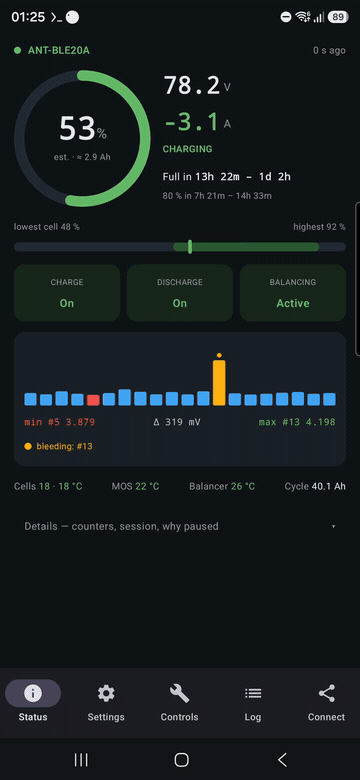

# ANT BMS Tool

[](https://github.com/Wnt/ant-bms-tool/actions/workflows/build.yml)

A standalone Android app for ANT BMS units that speak ANT's **old Bluetooth protocol**
(`DB DB` status poll, `5A 5A` register read, `A5 A5` register write). It shows the live state of the
pack and lets you read and change every BMS setting — with each write read back from the BMS before
it is reported as done.



## Why

The official ANT app only speaks the newer `7E A1` protocol on its settings, password and control
pages. On an older BMS every one of those writes is silently ignored — parameters read as 0, the
password is never verified, "start balancing" does nothing. This app talks the protocol the BMS
actually understands.

## Features

- **Status** — pack voltage, current, power; state-of-charge *estimated from cell voltages* (the BMS's
  own counter resets to 100 % on every cell-over-voltage trip, so it is unusable on an unbalanced
  pack); lowest/highest-cell band; charge / discharge / balancing state; a 20-cell bar strip where
  the cells the balancer is bleeding pulse amber; temperatures; charge-time estimates that model the
  charger *and* the balancer ("the remaining 2.6 Ah must first be bled from #13").
- **Settings** — every documented register grouped (voltage, current, balance, temperature, battery,
  system), in engineering units, with range checks; *Write & apply* writes, reads back, and sends the
  "apply" control so protections are re-evaluated immediately.
- **Controls** — charge / discharge MOSFET on/off, auto-balance toggle (the BMS echoes the new state),
  zero-current calibration, apply; reboot / LiFePO₄ preset / factory reset / shutdown behind
  confirmation dialogs.
- **Log** — every frame sent and received, with timestamps; copy to clipboard.
- **Connect** — scan, pick the BMS, remembered for next time; auto-reconnect on link drops.

## Requirements

Android 8.0+ with Bluetooth LE. Tested on a Samsung S25 (Android 16) with an `ANT-BLE20A` module on a
20S pack. Only the old protocol is implemented; a BMS that answers `7E A1 …` frames is not supported
(the official app works for those).

## Install

Download the APK from the latest [release](https://github.com/Wnt/ant-bms-tool/releases) or from the
artifacts of a [Build](https://github.com/Wnt/ant-bms-tool/actions/workflows/build.yml) run, and install
it (it is a debug-signed build). Grant the "Nearby devices" permission when asked.

## Build

Kotlin + Jetpack Compose, AGP 8.7, Gradle 8.11 (wrapper included), JDK 17.

```
./gradlew assembleDebug        # -> app/build/outputs/apk/debug/app-debug.apk
```

CI builds the APK on every push to `main` and attaches it to a GitHub Release on `v*` tags.

## Project layout

| path | purpose |
|---|---|
| `app/src/main/java/dev/bmstool/ant/protocol/OldProtocol.kt` | frames, checksum, status-frame parser, frame reassembly, register table, controls |
| `…/protocol/SocEstimate.kt`, `…/protocol/ChargeTime.kt` | voltage-based SOC and charge-time models |
| `…/ble/BleBmsConnection.kt` | plain `BluetoothGatt` link: 1 s status polling (the module drops an idle link after ~9 s), serialized writes, echo matching, reconnect |
| `…/AppViewModel.kt` | parameter/control transactions with read-back |
| `…/ui/{status,settings,controls,log,connect}` | the five tabs |
| `docs/PROTOCOL.md` | the protocol as reverse-engineered and verified on a real unit — old protocol (this app) and new |

## Safety

This app changes protection settings of a lithium battery management system. A wrong value can let a
pack over-charge, over-discharge or over-heat. Understand what a register does before changing it, keep
the BMS's own protections sensible for your cells, and use it at your own risk.

## Credits

- Old-protocol register map: the [VBMS wiki](https://github.com/klotztech/VBMS/wiki/Serial-protocol).
- Status-frame layout and the new protocol: the ANT app's own bundle, plus
  [syssi/esphome-ant-bms](https://github.com/syssi/esphome-ant-bms).

## License

[MIT](LICENSE)
